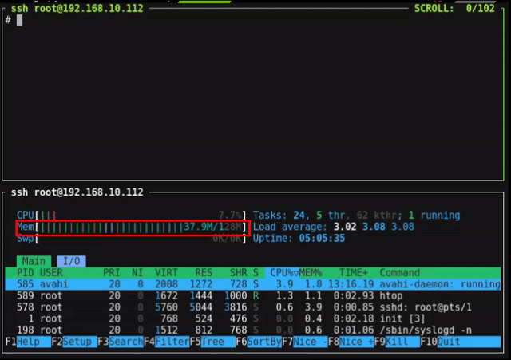

<div align="center">


# Clawy

**Ultra-lightweight AI Assistant in Go. Runs on $10 hardware with <10MB RAM.**

<p>
  
  
  
  <br>
  <a href="https://clawy.io"></a>
  <a href="https://docs.clawy.io/"></a>
  <a href="https://deepwiki.com/Kantemba/clawy"></a>
  <br>
  <a href="https://x.com/SipeedIO"></a>
  <a href="./assets/wechat.png"></a>
  <a href="https://discord.gg/V4sAZ9XWpN"></a>
</p>

[中文](docs/project/README.zh.md) | [日本語](docs/project/README.ja.md) | [한국어](docs/project/README.ko.md) | [Português](docs/project/README.pt-br.md) | [Tiếng Việt](docs/project/README.vi.md) | [Français](docs/project/README.fr.md) | [Italiano](docs/project/README.it.md) | [Bahasa Indonesia](docs/project/README.id.md) | [Malay](docs/project/README.ms.md) | **English**

</div>

---

> **Clawy** is an independent open-source project initiated by [Sipeed](https://sipeed.com), written entirely in **Go** from scratch — not a fork of OpenClaw, NanoBot, or any other project.

<table align="center">
<tr align="center">
<td align="center" valign="top">
<p align="center">

</p>
</td>
<td align="center" valign="top">
<p align="center">

</p>
</td>
</tr>
</table>

> [!CAUTION]
> **Security Notice**
>
> * **NO CRYPTO:** Clawy has **not** issued any official tokens or cryptocurrency. All claims on `pump.fun` or other trading platforms are **scams**.
> * **OFFICIAL DOMAIN:** The **ONLY** official website is **[clawy.io](https://clawy.io)**, and company website is **[sipeed.com](https://sipeed.com)**
> * **BEWARE:** Many `.ai/.org/.com/.net/...` domains have been registered by third parties. Do not trust them.
> * **NOTE:** Clawy is in early rapid development. There may be unresolved security issues. Do not deploy to production before v1.0.
> * **NOTE:** Clawy has recently merged many PRs. Recent builds may use 10-20MB RAM. Resource optimization is planned after feature stabilization.

---

## Features

- **Ultra-lightweight** — Core memory footprint <10MB (99% less than OpenClaw)
- **Minimal cost** — Runs on $10 hardware (98% cheaper than a Mac mini)
- **Lightning-fast boot** — Boots in <1s even on a 0.6GHz single-core processor
- **Truly portable** — Single binary across RISC-V, ARM, MIPS, x86, and LoongArch
- **AI-bootstrapped** — 95% of core code generated by an Agent
- **MCP support** — Native [Model Context Protocol](https://modelcontextprotocol.io/) integration
- **Vision pipeline** — Send images and files directly to the Agent
- **Smart routing** — Rule-based model routing to save API costs

<div align="center">

|                                | OpenClaw      | NanoBot                  | **Clawy**                           |
| ------------------------------ | ------------- | ------------------------ | -------------------------------------- |
| **Language**                   | TypeScript    | Python                   | **Go**                                 |
| **RAM**                        | >1GB          | >100MB                   | **< 10MB***                            |
| **Boot time**</br>(0.8GHz core) | >500s         | >30s                     | **<1s**                                |
| **Cost**                       | Mac Mini $599 | Most Linux boards ~$50   | **Any Linux board**</br>**from $10**   |


</div>

> **[Hardware Compatibility List](docs/guides/hardware-compatibility.md)** — See all tested boards, from $5 RISC-V to Raspberry Pi to Android phones.

<p align="center">

</p>

---

## Install

### Quick Install

Visit **[clawy.io](https://clawy.io)** — the official website auto-detects your platform and provides one-click download.

```bash
# Linux / macOS (installs clawy + clawy-launcher to ~/.local/bin)
curl -fsSL https://raw.githubusercontent.com/Kantemba/clawy/main/scripts/install.sh | sh
```

Container images (GitHub Packages) are published on every release:

```bash
docker pull ghcr.io/kantemba/clawy:latest
docker pull ghcr.io/kantemba/clawy:launcher
```

Installed binaries self-notify on new releases (cached daily, offline-safe).
Disable with `CLAWY_NO_UPDATE_CHECK=1`. Check manually with
`clawy update --check` / `clawy version --check`, upgrade with `clawy update`.

### Manual Install

Grab the right artifact from [GitHub Releases](https://github.com/Kantemba/clawy/releases):

| Platform | Artifact | Notes |
|----------|----------|-------|
| Windows | `ClawySetup-<version>.exe` | Full installer with Start Menu / desktop shortcuts |
| macOS | `clawy_<version>_macOS_<arch>.dmg` | Drag-and-drop `.app` bundle |
| Debian / Ubuntu | `clawy_<version>_x86_64.deb` | Installs `clawy` and `clawy-launcher` to `/usr/bin` |
| RHEL / Fedora | `clawy_<version>_x86_64.rpm` | Same layout as the deb |
| Any other OS/arch | `clawy_<Os>_<Arch>.tar.gz` (`.zip` on Windows) | Portable binaries |

### Build from Source

Prerequisites: Go 1.25+, Node.js 22+ and pnpm 10.33.0+ for Web UI

```bash
git clone https://github.com/Kantemba/clawy.git
cd clawy
make deps
(cd web/frontend && pnpm install --frozen-lockfile)
make build
make build-launcher
```

---

## Quick Start

### WebUI Launcher (Recommended)

Double-click `clawy-launcher` (or run it from the terminal). Your browser opens at `http://localhost:18800`.

> [!TIP]
> **Remote access / Docker / VM:** Add the `-public` flag to listen on all interfaces:
> ```bash
> clawy-launcher -public
> ```

<p align="center">

</p>

**Steps:** Configure a Provider (API key) → Configure a Channel (e.g., Telegram) → Start the Gateway → Chat!

<details>
<summary><b>Docker</b></summary>

```bash
git clone https://github.com/Kantemba/clawy.git && cd clawy
docker compose -f docker/docker-compose.yml --profile launcher up
# Edit docker/data/config.json with your API keys
docker compose -f docker/docker-compose.yml --profile launcher up -d
# Open http://localhost:18800
```

</details>

### Android

Download the APK from [clawy.io](https://clawy.io/download/) or use Termux. See [Android Termux Guide](docs/guides/android-termux.md) for details.

### Terminal Launcher

For minimal environments without the Launcher UI:

```bash
clawy onboard          # Initialize config & workspace
clawy agent -m "..."   # One-shot question
clawy agent            # Interactive chat
clawy gateway          # Start the gateway
```

Edit `~/.clawy/config.json`:

```json
{
  "agents": {
    "defaults": {
      "model_name": "gpt-5.4"
    }
  },
  "model_list": [
    {
      "model_name": "gpt-5.4",
      "model": "openai/gpt-5.4"
    }
  ]
}
```

---

## Providers (LLM)

30+ providers via `protocol/model` format:

| Provider | Protocol | API Key |
|----------|----------|---------|
| [OpenAI](https://platform.openai.com/api-keys) | `openai/` | Required |
| [Anthropic](https://console.anthropic.com/settings/keys) | `anthropic/` | Required |
| [Google Gemini](https://aistudio.google.com/apikey) | `gemini/` | Required |
| [OpenRouter](https://openrouter.ai/keys) | `openrouter/` | Required |
| [Zhipu (GLM)](https://open.bigmodel.cn/usercenter/proj-mgmt/apikeys) | `zhipu/` | Required |
| [DeepSeek](https://platform.deepseek.com/api_keys) | `deepseek/` | Required |
| [Volcengine](https://console.volcengine.com) | `volcengine/` | Required |
| [Qwen](https://dashscope.console.aliyun.com/apiKey) | `qwen/` | Required |
| [Groq](https://console.groq.com/keys) | `groq/` | Required |
| [Moonshot (Kimi)](https://platform.moonshot.cn/console/api-keys) | `moonshot/` | Required |
| [Minimax](https://platform.minimaxi.com/user-center/basic-information/interface-key) | `minimax/` | Required |
| [Mistral](https://console.mistral.ai/api-keys) | `mistral/` | Required |
| [NVIDIA NIM](https://build.nvidia.com/) | `nvidia/` | Required |
| [Cerebras](https://cloud.cerebras.ai/) | `cerebras/` | Required |
| [NEAR AI Cloud](https://near.ai/) | `nearai/` | Required |
| [Novita AI](https://novita.ai/) | `novita/` | Required |
| [Xiaomi MiMo](https://platform.xiaomimimo.com/) | `mimo/` | Required |
| [Ollama](https://ollama.com/) | `ollama/` | Not needed |
| [vLLM](https://docs.vllm.ai/) | `vllm/` | Not needed |
| [LiteLLM](https://docs.litellm.ai/) | `litellm/` | Varies |
| [Azure OpenAI](https://portal.azure.com/) | `azure/` | API key or Entra ID |
| [GitHub Copilot](https://github.com/features/copilot) | `github-copilot/` | OAuth |
| [AWS Bedrock](https://console.aws.amazon.com/bedrock) | `bedrock/` | AWS credentials |

<details>
<summary><b>Local deployment examples</b></summary>

**Ollama:**
```json
{
  "model_list": [{
    "model_name": "local-llama",
    "model": "ollama/llama3.1:8b",
    "api_base": "http://localhost:11434/v1"
  }]
}
```

**vLLM:**
```json
{
  "model_list": [{
    "model_name": "local-vllm",
    "model": "vllm/your-model",
    "api_base": "http://localhost:8000/v1"
  }]
}
```

</details>

> Full details: [Providers & Models](docs/guides/providers.md)

---

## Channels (Chat Apps)

20+ messaging platforms:

| Channel | Setup | Docs |
|---------|-------|------|
| **Telegram** | Easy (bot token) | [Guide](docs/channels/telegram/README.md) |
| **Discord** | Easy (bot token + intents) | [Guide](docs/channels/discord/README.md) |
| **WhatsApp** | Easy (QR scan or bridge URL) | [Guide](docs/guides/chat-apps.md#whatsapp) |
| **Weixin** | Easy (Native QR scan) | [Guide](docs/guides/chat-apps.md#weixin) |
| **QQ** | Easy (AppID + AppSecret) | [Guide](docs/channels/qq/README.md) |
| **Slack** | Easy (bot + app token) | [Guide](docs/channels/slack/README.md) |
| **Matrix** | Medium (homeserver + token) | [Guide](docs/channels/matrix/README.md) |
| **Delta Chat** | Easy (account script or email/password) | [Guide](docs/channels/deltachat/README.md) |
| **DingTalk** | Medium (client credentials) | [Guide](docs/channels/dingtalk/README.md) |
| **Feishu / Lark** | Medium (App ID + Secret) | [Guide](docs/channels/feishu/README.md) |
| **LINE** | Medium (credentials + webhook) | [Guide](docs/channels/line/README.md) |
| **WeCom** | Easy (QR login or manual) | [Guide](docs/channels/wecom/README.md) |
| **VK** | Easy (group token) | [Guide](docs/channels/vk/README.md) |
| **IRC** | Medium (server + nick) | [Guide](docs/guides/chat-apps.md#irc) |
| **OneBot** | Medium (WebSocket URL) | [Guide](docs/channels/onebot/README.md) |
| **MQTT** | Easy (broker + agent_id) | [Guide](docs/channels/mqtt/README.md) |
| **MaixCam** | Easy (enable) | [Guide](docs/channels/maixcam/README.md) |
| **WebChat** | Easy (enable) | Built-in |
| **Custom Webhook** | Easy (optional token) | [Guide](docs/channels/webhook/README.md) |

> Full details: [Chat Apps Configuration](docs/guides/chat-apps.md)

---

## Tools

### Web Search

| Engine | API Key | Free Tier |
|--------|---------|-----------|
| DuckDuckGo | Not needed | Unlimited |
| [Gemini Google Search](https://aistudio.google.com/apikey) | Required | Varies |
| [Baidu Search](https://cloud.baidu.com/doc/qianfan-api/s/Wmbq4z7e5) | Required | 1500/month |
| [Tavily](https://tavily.com) | Required | 1000/month |
| [Brave Search](https://brave.com/search/api) | Required | 2000/month |
| [Kagi Search](https://help.kagi.com/kagi/api/search.html) | Required | Paid |
| [Perplexity](https://www.perplexity.ai) | Required | Paid |
| [SearXNG](https://github.com/searxng/searxng) | Not needed | Self-hosted |

### Terminal Backends

Run commands locally, in Docker, or over SSH — the Agent doesn't need to know:

```json
"tools": {
  "exec": {
    "backend": "docker",
    "docker_container": "my-dev-box",
    "docker_shell": "bash"
  }
}
```

### Skills

Extend your Agent with modular capabilities from ClawHub:

```bash
clawy skills search "web scraping"
clawy skills install <skill-name>
```

### MCP (Model Context Protocol)

Connect any MCP server to extend Agent capabilities:

```json
{
  "tools": {
    "mcp": {
      "enabled": true,
      "servers": {
        "filesystem": {
          "command": "npx",
          "args": ["-y", "@modelcontextprotocol/server-filesystem", "/tmp"]
        }
      }
    }
  }
}
```

Or manage via CLI:

```bash
clawy mcp add filesystem -- npx -y @modelcontextprotocol/server-filesystem /tmp
clawy mcp list
clawy mcp test filesystem
```

> Full details: [Tools Configuration](docs/reference/tools_configuration.md)

---

## CLI Reference

| Command | Description |
|---------|-------------|
| `clawy onboard` | Initialize config & workspace |
| `clawy agent -m "..."` | Chat with the agent |
| `clawy agent` | Interactive chat mode |
| `clawy gateway` | Start the gateway |
| `clawy status` | Show status |
| `clawy version` | Show version info (`--check` queries GitHub releases) |
| `clawy update` | Check + apply updates (`--check` only checks, `--nightly` uses nightly) |
| `clawy model` | View or switch the default model |
| `clawy mcp list\|add\|test\|edit\|remove` | Manage MCP servers |
| `clawy cron list\|add\|disable\|remove` | Manage scheduled jobs |
| `clawy pairing list\|approve\|reject` | Manage sender access |
| `clawy skills list\|install` | Manage skills |
| `clawy migrate` | Migrate data from older versions |

---

## Documentation

| Topic | Description |
|-------|-------------|
| [Docker & Quick Start](docs/guides/docker.md) | Docker Compose setup |
| [Chat Apps](docs/guides/chat-apps.md) | All channel setup guides |
| [Configuration](docs/guides/configuration.md) | Environment variables, workspace layout |
| [Providers & Models](docs/guides/providers.md) | 30+ LLM providers |
| [Tools Configuration](docs/reference/tools_configuration.md) | Per-tool enable/disable, exec, MCP, Skills |
| [MCP Server CLI](docs/reference/mcp-cli.md) | MCP CLI commands |
| [Hardware Compatibility](docs/guides/hardware-compatibility.md) | Tested boards |
| [Hooks](docs/architecture/hooks/README.md) | Event-driven hook system |
| [Steering](docs/architecture/steering.md) | Inject messages between tool calls |
| [SubTurn](docs/architecture/subturn.md) | Subagent coordination |
| [Troubleshooting](docs/operations/troubleshooting.md) | Common issues and solutions |

---

## Contribute

PRs welcome! See our [Community Roadmap](https://github.com/Kantemba/clawy/issues/988) and [CONTRIBUTING.md](CONTRIBUTING.md).

**Discord:** <https://discord.gg/V4sAZ9XWpN>

**WeChat:**

